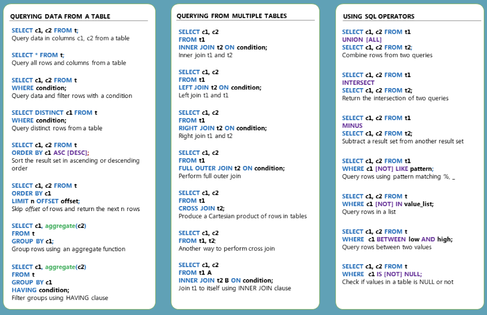

# Final-Project-Transforming-and-Analyzing-Data-with-SQL

## Project/Goals
This is my SQL Project

[This is a link to google](www.google.com)

## Process
### (your step 1)
### (your step 2)

## Results
(fill in what you discovered this data could tell you and how you used the data to answer those questions)

## Challenges 
(discuss challenges you faced in the project)

## Future Goals
(what would you do if you had more time?)
